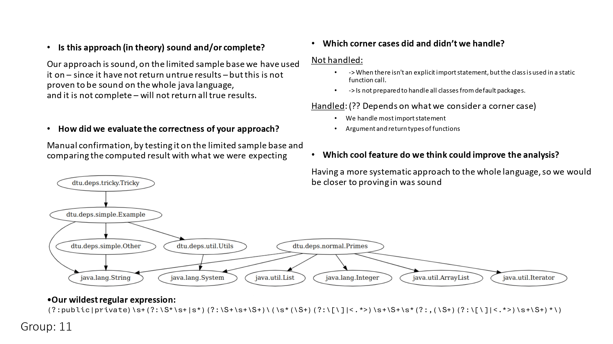

# Assignment 1 - Source Dependency Graph

### :page_with_curl: Challenge
This week's exercise focused on the development of a **source dependency graph** tool used to create graphs for a Java project. It should be based on the use of **regular expressions**.

The challenge is detailed on [Source-Dependency-Graph.pdf](https://github.com/immarianaas/pa-23/blob/master/assignment-1/Soure-Dependency-Graph.pdf).

### :bar_chart: Results
The results obtained, along with reflexion on the exercise, were presented to the class using the following slide. The `pdf` version can be found on [slide.pdf](https://github.com/immarianaas/pa-23/blob/master/assignment-1/slide.pdf).

    

