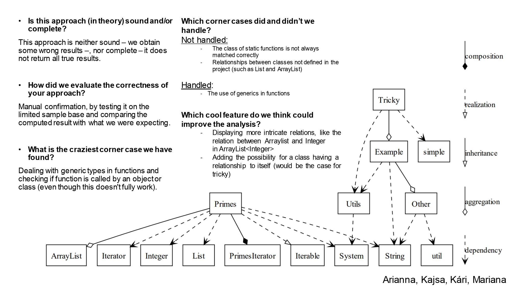

# Assignment 2 - Class Diagram

### :page_with_curl: Challenge
After realising that regular expressions aren't suitable for many problems in code analysis, this week's exercise proposed the use of a **syntax tree** for the development of a **dlass diagram** tool. This tool should be able to analyse Java projects. The tool suggested - and the one we used - is [Tree-sitter](https://tree-sitter.github.io/tree-sitter/).

The challenge is detailed on [Class-Diagram.pdf](https://github.com/immarianaas/pa-23/blob/master/assignment-2/Class-Diagram.pdf).

### :bar_chart: Results
The results obtained, along with reflexion on the exercise, were presented to the class using the following slide. The `pdf` version can be found on [slide.pdf](https://github.com/immarianaas/pa-23/blob/master/assignment-2/slide.pdf).

    

