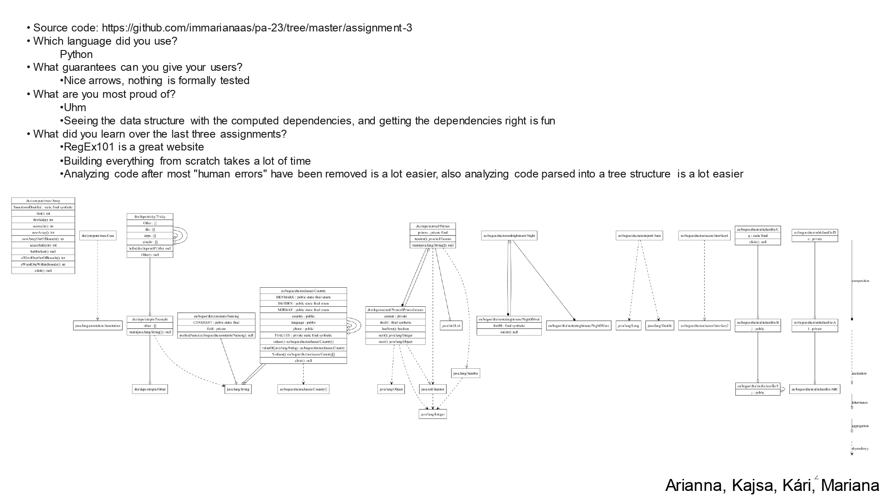

# Assignment 3 - Detailed Class Diagram

### :page_with_curl: Challenge
This exercise focused on the development of a tool that creates a **detailed class diagram** - a class diagram with information on methods and attributes - from a Java project.

This should be performed by analysing the Java bytecode. We used the tool [jvm2json](https://gitlab.gbar.dtu.dk/chrg/jvm2json), developed by the course professor, Christian Gram Kalhauge.

The challenge is detailed on [Detailed-Class-Diagram.pdf](https://github.com/immarianaas/pa-23/blob/master/assignment-3/Detailed-Class-Diagram.pdf).

### :bar_chart: Results
The results obtained, along with reflexion on the exercise, were presented to the class using the following slide. The `pdf` version can be found on [slide.pdf](https://github.com/immarianaas/pa-23/blob/master/assignment-3/slide.pdf).

    

