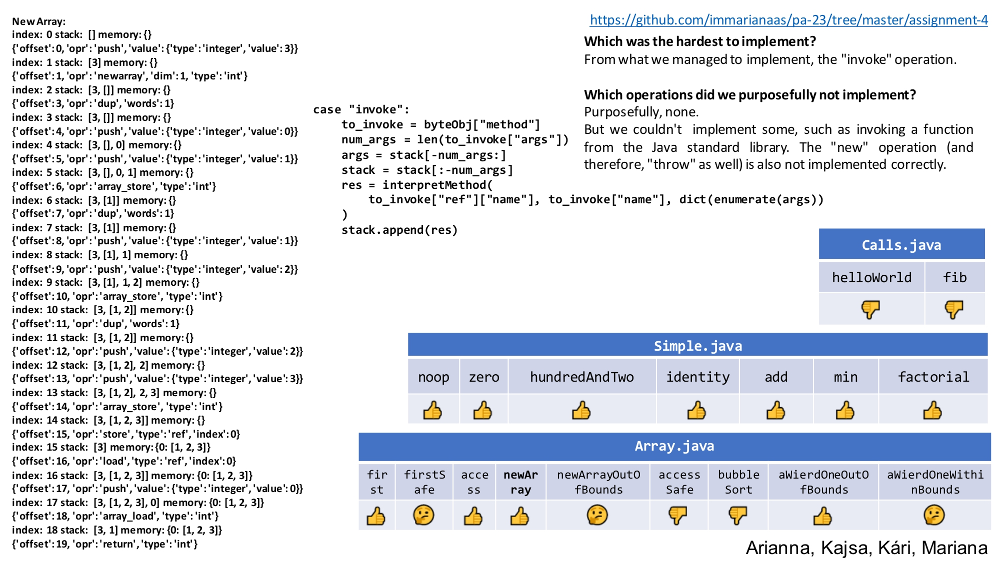

# Assignment 4 - Interpretation

### :page_with_curl: Challenge
This exercise challenged us to develop a **semantic dynamic analysis** tool. In particular, we were to develop a **interpreter for JVM bytecode**. For this, we used the [jvm2json](https://gitlab.gbar.dtu.dk/chrg/jvm2json) tool again.

The challenge is detailed on [Interpretation.html](https://github.com/immarianaas/pa-23/blob/master/assignment-4/Interpretation.html).

### :bar_chart: Results
The results obtained, along with reflexion on the exercise, were presented to the class using the following slide. The `pdf` version can be found on [slide.pdf](https://github.com/immarianaas/pa-23/blob/master/assignment-4/slide.pdf).

    

