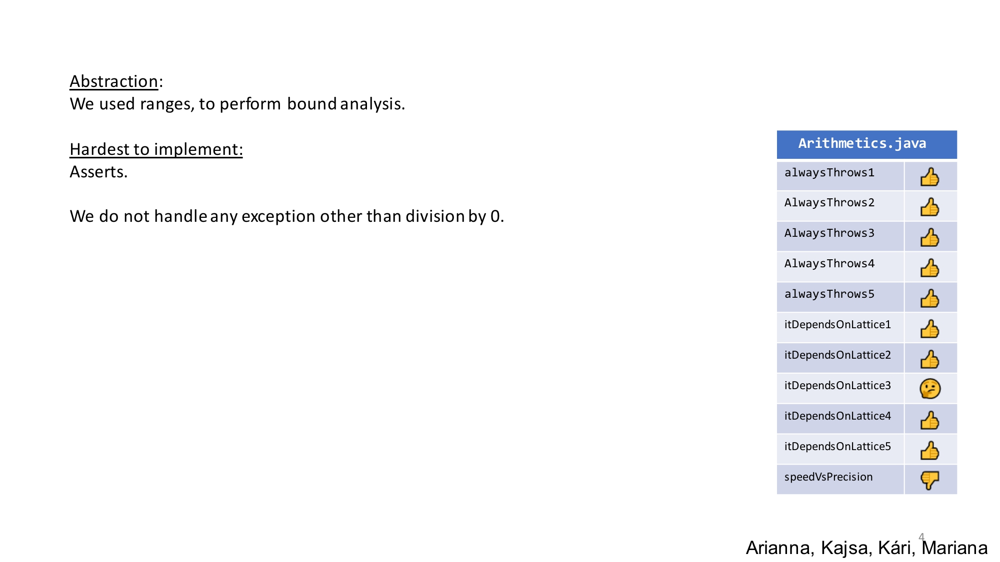

# Assignment 5 & 6 - Abstract Interpretation

### :page_with_curl: Challenges
The exercise on **abstract interpretation** was divided in 2 weeks.

The first one focused on developing a tool that can predict if there exists an input that can cause a method to throw one of 4 determined exceptions. This tool should be based on **bouded abstract interpretation**.

The second part of the exercise was a continuation to the first one, in which we were to obtain the same information, using an **unbounded abstract interpretation**.

This exercise was based on the analysis of Java bytecode, using the [jvm2json](https://gitlab.gbar.dtu.dk/chrg/jvm2json) tool.

The 2 parts of this challenge are detailed on [Abstract-Interpretation-1.html](https://github.com/immarianaas/pa-23/blob/master/assignment-5-6/Abstract-Interpretation-1.html) and [Abstract-Interpretation-2.html](https://github.com/immarianaas/pa-23/blob/master/assignment-5-6/Abstract-Interpretation-2.html).

### :bar_chart: Results
The results obtained, along with reflexion on the exercise, were presented to the class using the following slide. The `pdf` version can be found on [slide.pdf](https://github.com/immarianaas/pa-23/blob/master/assignment-5-6/slide.pdf).

Unfortunately this exercise didn't go so well, due to both the optional nature of the assignment, and the other tasks at hand in other courses.

    

